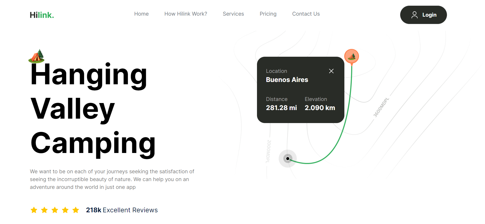

# Travel Camping Landing Page
## Project Description
The Travel Camping Landing Page is a modern and visually appealing website designed to promote camping and outdoor adventure experiences. Built using Next.js and Tailwind CSS, the landing page aims to attract outdoor enthusiasts by highlighting scenic destinations, camping packages, and adventure activities. The site offers a seamless user experience with responsive design, smooth animations, and intuitive navigation, encouraging users to explore and book their next outdoor adventure.

## Live Site: 
[Travel Page](https://travelcampingage.netlify.app/)

## Screenshot


## Features
- Modern Design: A clean and modern design to make a great first impression.
- Responsive Layout: Fully responsive design ensuring optimal user experience on all devices.
- Scenic Destinations: Showcase breathtaking camping locations with stunning imagery and descriptions.
- Camping Packages: Display various camping packages with detailed itineraries and pricing.
- SEO Optimized: Ensures better visibility on search engines.

## Technologies Used
- Next.js: React framework for server-side rendering and static site generation.
- React: JavaScript library for building user interfaces.
- Tailwind CSS: Utility-first CSS framework for styling.


## Getting Started
Prerequisites
Node.js
npm (or yarn)

# Installation
Clone the repository:
```bash
Copy code
git clone https://github.com/akdhiman358/Travel_page.git
```
Navigate to the project directory:
```bash
Copy code
cd portfolio
```
Install dependencies:
```bash
Copy code
npm install
```
or
```bash
Copy code
yarn install
```
Running the Development Server
```bash
Copy code
npm run dev
```
or

```bash
Copy code
yarn dev
```
Open http://localhost:3000 in your browser to see the result.

Building for Production
```bash
Copy code
npm run build
```
or

```bash
Copy code
yarn build
```
Running in Production Mode
After building the project, you can start it in production mode with:

```bash
Copy code
npm start
```
or

```bash
Copy code
yarn start
```
### Deploying
This project can be deployed to any static site hosting service. Netlify is used for the live version.

### Contributing
If you have suggestions for improvements or encounter any issues, feel free to open an issue or submit a pull request.

### Contact
For any inquiries, please reach out to me via akshayud0@gmail.com
